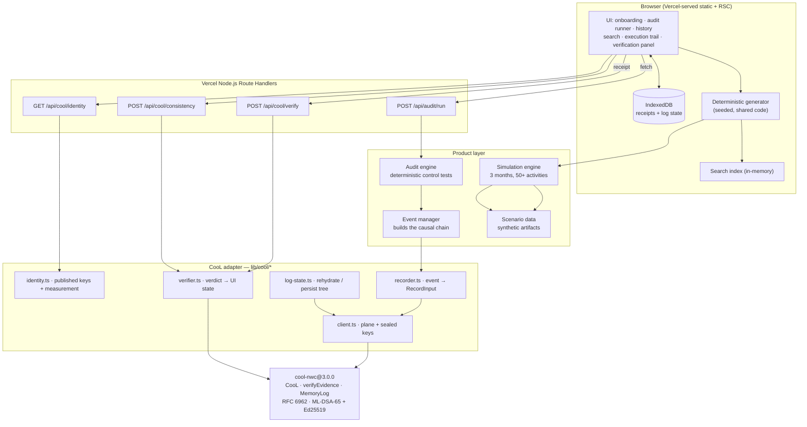
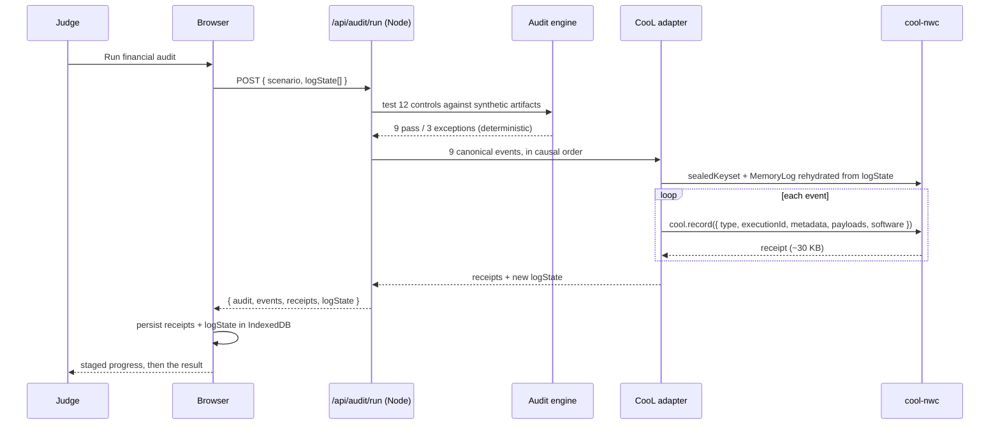
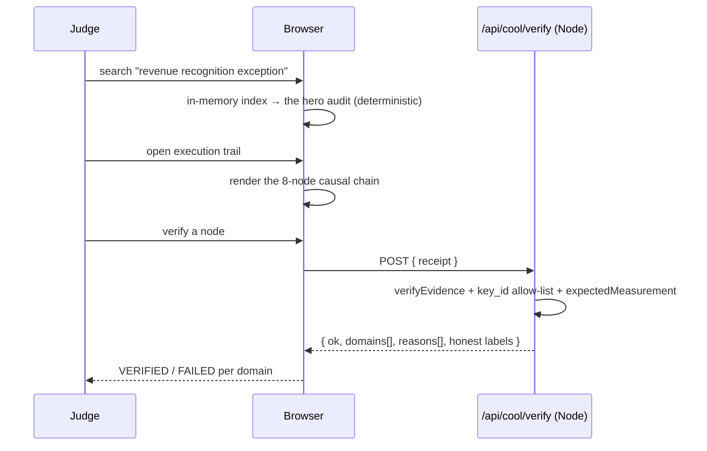

# Architecture

Derived from the repository inspection and from the SDK findings in
`COOL_SDK_AUDIT.md`. Tags: `CONFIRMED` / `INFERRED` / `TODO` / `UNKNOWN`.

> **Milestone 1 status.** The stack (§3), the no-database decision (§4), and the
> CooL layer of the module map (§6) are built and proved on Vercel. The product
> layers — audit engine, events, simulation, search, UI — are still planned.
> `[M1]` in §6 marks what exists.

---

## 1. Repository inventory (before implementation)

`CONFIRMED` — the workspace currently contains only the CooL clone and the two
briefs. There is no VeriAudit application code, no `package.json` at the root,
no frontend, no backend, no tests, no CI.

```text
VeriAudit/                       ← git repo, branch master, NO COMMITS YET
├── VeriAudit_SOURCE_OF_TRUTH.md        product authority
├── VeriAudit_CURSOR_BUILD_GUIDELINE.md build discipline
├── cool-sdk/                    ← cloned upstream SDK, has its OWN .git @ 0eaf985
│   ├── package.json             cool-nwc @ 3.0.0, ESM, node >=20
│   ├── src/                     16 core modules + cli/ (12) + phala/ (25)
│   ├── tests/                   10 test files (SDK's own)
│   ├── examples/                basic, agent, express, verification, dstack
│   ├── docs/                    12 docs incl. evidence-format, verification,
│   │                            security-model, threat-model, troubleshooting
│   ├── scripts/                 build.mjs, demo.ts, run-tests.mjs
│   └── HACKATHON.md             vendor guidance on claims
├── cool-proof/                  ← created during this discovery phase
│   ├── proof.mjs … proof4.mjs   SDK verification harnesses
│   ├── proof-output.txt …       captured real output
│   ├── browser/                 esbuild bundle + page for the browser probe
│   └── serve.mjs                static server for that probe
└── docs/                        ← this documentation set
```

Answers to the required inventory questions:

| Question | Answer |
|---|---|
| Project type | **Nothing yet.** Greenfield, to be created. |
| Frontend framework | None → **Next.js 15 App Router** (decision, §3) |
| Backend framework | None → **Next.js Route Handlers** on Vercel Node runtime |
| Package manager | None → **npm** (matches the SDK's own lockfile and the documented install) |
| Existing scripts | Only the SDK's (`build`, `test`, `typecheck`, `demo`, `verify:package`) |
| Existing dependencies | Only the SDK's: `@noble/curves`, `@noble/hashes`, `@noble/post-quantum`, `cbor2`, `ulid` |
| Existing database/storage | **None.** SDK offers `MemoryLog` and `FileLog` only |
| Environment configuration | None. SDK reads optional `COOL_IMAGE_DIGEST`, `COOL_DSTACK_ENDPOINT` |
| Build configuration | Only the SDK's (`tsconfig*.json`, `scripts/build.mjs`) |
| Deployment configuration | **None.** SDK has `.dockerignore` + `examples/dstack/` for CVMs — not relevant to Vercel |
| Existing UI/components | **None.** The SDK ships one CLI HTML page (`src/cli/ui/app.html`) — unrelated |
| Existing API routes | **None** |
| Existing CooL code | The whole upstream SDK, plus our 4 proof harnesses |
| Existing tests | The SDK's 10; **none for VeriAudit** |
| Existing documentation | Two root briefs + 12 SDK docs. Preserved, not duplicated — `COOL_SDK_AUDIT.md` cites them and records where our observations differ |
| Existing assets | `cool-sdk/assets/` (SDK's own) |
| Existing sample data | **None.** All scenario data must be authored |

### Repository layout decision

Per source-of-truth §8, this is a **VeriAudit repository that consumes CooL as a
dependency**:

- `cool-nwc@3.0.0` comes **from npm**. `CONFIRMED` published and installable.
- `cool-sdk/` stays as a local read-only reference and is **git-ignored** — it is
  a separate upstream repo with its own `.git`, and committing it would create a
  nested repository and bury VeriAudit's code.
- `cool-proof/` is committed. It is the reproducible evidence behind
  `COOL_SDK_AUDIT.md`, and Milestone 1 of the plan is "real CooL integration
  proof" — this is that proof.

---

## 2. Layer separation

Per the build guideline §5, the product layer and the CooL layer stay distinct.

**Product layer (VeriAudit owns)** — audit workflows, scenario data, event
semantics, the execution graph, search, the 3-month simulation, human review, all
UI.

**CooL layer (the SDK provides)** — canonicalisation, salted commitments, hybrid
post-quantum signing, the RFC 6962 transparency log, and the 7-domain verifier.

CooL is **not** the application database. It stores nothing queryable: a receipt
contains only commitments, and `COOL_SDK_AUDIT.md` §4 confirms no raw value is
recoverable from it. VeriAudit keeps its own records and references receipts.

---

## 3. Chosen stack

| Concern | Choice | Why |
|---|---|---|
| Framework | Next.js 15, App Router, TypeScript, React 19 | one deployable unit gives both the UI and the Node-runtime functions CooL needs; Vercel's first-class target |
| Styling | Tailwind CSS v4 | zero-config in Next 15; no component-library setup cost |
| Components | hand-written | build-guideline Rule 5: don't overbuild |
| Graph UI | hand-laid-out SVG/CSS, fixed causal spine | the trail is a known 8-node chain, not an arbitrary graph. A graph library is cost with no benefit (guideline §13: "do not make a random node graph") |
| Server runtime | **Vercel Node.js functions** (`export const runtime = "nodejs"`) | vendor declines to support Edge; ML-DSA is CPU-bound. See `COOL_SDK_AUDIT.md` §9 |
| Database | **none** | see §4 |
| Search | in-process deterministic inverted index | reliability over sophistication (guideline §12) |
| Package manager | npm | |

---

## 4. The storage decision

This is the load-bearing architectural choice, and it follows directly from four
`CONFIRMED` SDK properties:

1. Sealed keys are a pure function of `(applicationId, COOL_IMAGE_DIGEST)` — so
   any instance in a stateless fleet signs under one stable identity, with no
   key storage and no secret.
2. Receipts are self-contained — verification needs no live plane and no service.
3. A transparency tree rehydrates from nothing but an **ordered list of public
   `binding_hash` strings**.
4. `EvidenceLog.append()` is **synchronous** — so an async-storage-backed log is
   impossible anyway; the tree must be in memory when recording.

Therefore **VeriAudit ships with no database**, in two halves:

**(a) History is generated, not stored.** Every audit, event, finding, review,
and all 50+ simulated activities are a pure function of a fixed seed, in code.
Identical on every instance, every cold start, every judge's browser. This is
also what satisfies the determinism requirement (source of truth §10) and makes
the "clean browser" test trivial: there is nothing to have lost.

**(b) Evidence is session-held.** Receipts are sealed server-side on demand and
returned to the client, which keeps them in **IndexedDB** (~30 KB each rules out
`localStorage`). The client also holds the **log state** — the ordered
`binding_hash` list — and passes it back on each recording call, so the server
rehydrates one growing append-only tree across stateless invocations. A
module-scope LRU cache on the server serves warm-instance reads.

Honest consequence, to be stated in the UI and the README: the transparency log
demonstrates append-only structure **within a session**, sequenced by a
client-held head. It is not an independently witnessed log — which the SDK
already forces us to admit, since `witnesses` is permanently `absent`.

**CONFIRMED in Milestone 1: no database is needed for the evidence path.** The
`logState` round trip works exactly as inferred. Two stateless `recordEvents`
calls, the second given only the first's ordered `binding_hash` list, produced
leaves 4–8 of one nine-leaf tree; rehydrating from the stored list reproduced
the previously signed root exactly; receipts sealed in the first call still
verified after the tree grew; and an RFC 6962 consistency proof held for honest
growth while failing when a historical entry was removed. Proved on Vercel as
well as locally — `DEPLOYMENT.md` §11.

One implementation detail this forced: `assertValidLogState` must reject
malformed input loudly rather than defaulting to an empty tree. Silently
starting over would convert a tampered history into a fresh, perfectly valid
one — the failure mode the log exists to prevent.

`TODO` (P1, only if the session model proves fragile in the Milestone 8 Vercel
test): add Upstash Redis behind the same adapter interface. Deliberately deferred
— it adds a provisioning step and env vars for a demo that does not need them.
Nothing found in Milestone 1 argues for it.

---

## 5. System architecture



Conceptually, matching the guideline's shape:

```text
Frontend
   ↓
API (Next.js route handlers, Node runtime)
   ↓
Audit engine
   ↓
Event manager
   ├── Storage   → deterministic generator + IndexedDB session store
   ├── Search    → in-memory inverted index
   └── CooL adapter
              ↓
          cool-nwc
```

---

## 6. Module map

`[M1]` exists as of Milestone 1; everything else is planned.

```text
veriaudit/
├── app/
│   ├── page.tsx                  [M1] developer proof page; becomes the scenario picker
│   ├── layout.tsx                [M1]
│   ├── audit/[auditId]/page.tsx       audit result + trail entry point
│   ├── history/page.tsx               3-month activity feed + search + filters
│   ├── trail/[executionId]/page.tsx   execution graph + evidence + verification
│   └── api/
│       ├── audit/run/route.ts         run audit, seal its events   (nodejs)
│       ├── cool/record/route.ts  [M1] seal canonical events         (nodejs)
│       ├── cool/verify/route.ts  [M1] verify a receipt              (nodejs)
│       ├── cool/identity/route.ts [M1] published key dir + measurement (nodejs)
│       ├── cool/selftest/route.ts [M1] tamper matrix; proof-only    (nodejs)
│       └── cool/consistency/route.ts  append-only proof             (nodejs)
├── lib/
│   ├── cool/                     [M1] THE ONLY PLACE THAT IMPORTS cool-nwc
│   │   ├── index.ts              [M1] barrel; carries import "server-only"
│   │   ├── config.ts             [M1] app id, image digest, log id, software identity
│   │   ├── identity.generated.ts [M1] COMMITTED pin — measurement + key directory
│   │   ├── identity.ts           [M1] pinned constants + live derivation + drift check
│   │   ├── canonical.ts          [M1] VeriAudit event → canonical committed payload
│   │   ├── recorder.ts           [M1] canonical payload → CooL receipt
│   │   ├── verifier.ts           [M1] Verdict + trust policy → IntegrityState
│   │   ├── log-state.ts          [M1] rehydrate/persist the RFC 6962 tree
│   │   ├── key-directory.ts      [M1] SDK key-directory type re-exports
│   │   └── types.ts              [M1] adapter-facing types, SDK-free
│   ├── proof/                    [M1] proof fixtures + tamper matrix; not product code
│   │   ├── sample-trail.ts       [M1] nine canonical events; replaced by lib/audit
│   │   └── tamper.ts             [M1] the 13-case matrix, shared by tests and selftest
│   ├── audit/
│   │   ├── engine.ts                  deterministic control testing
│   │   └── controls.ts                control definitions
│   ├── events/
│   │   ├── model.ts                   event types + relationships
│   │   └── builder.ts                 causal chain assembly
│   ├── simulation/
│   │   ├── generate.ts                3 months, 50+ activities, seeded
│   │   └── rng.ts                     seeded PRNG (no Math.random)
│   ├── search/
│   │   └── index.ts                   inverted index + filters
│   ├── scenarios/
│   │   ├── financial.ts               HERO — revenue recognition
│   │   ├── legal.ts                   P1
│   │   ├── cyber.ts                   P1
│   │   └── procurement.ts             P1
│   └── store/
│       └── session.ts                 IndexedDB receipts + log state
├── components/                        ui primitives + trail nodes + verdict panel
├── scripts/
│   ├── cool-identity.ts          [M1] regenerates the committed pin
│   └── proof-http.ts             [M1] 29-assertion HTTP proof, any base URL
├── tests/
│   └── cool-adapter.test.ts      [M1] 27 tests; see TESTING_PLAN.md
├── docs/                         [M1] this set
├── cool-proof/                   [M1] committed SDK proof harnesses + captured output
└── .env.example                       TODO — nothing requires env yet
```

**Rule** — nothing outside `lib/cool/` imports `cool-nwc`. `CONFIRMED` enforced
by a test that walks every `.ts`/`.tsx` file and fails on a stray import
(guideline Rule 3). `lib/proof/`, `scripts/`, and `tests/` are exempt by name.

`import "server-only"` sits in `lib/cool/index.ts` rather than in each module,
so a client component importing the adapter fails the build while the unit tests
can still import submodules directly under Vitest. `CONFIRMED` working: the
client bundle is 104 kB first-load JS, with no post-quantum crypto in it.

---

## 7. Request flows

### Running the hero audit



### Answering the boss question



---

## 8. Deliberate non-goals

Everything here is P2 in the source of truth and stays unbuilt: TEE deployment,
hardware attestation, witness infrastructure, Bitcoin anchoring, selective
disclosure UI, policy engines, a real database, authentication, multi-tenancy,
streaming LLM output.

Also avoided: a graph library, a component library, a state-management library,
an ORM, and a semantic/vector search engine. Each would cost setup time against
an 8-hour budget without improving the judge-facing core experience
(guideline §19).
