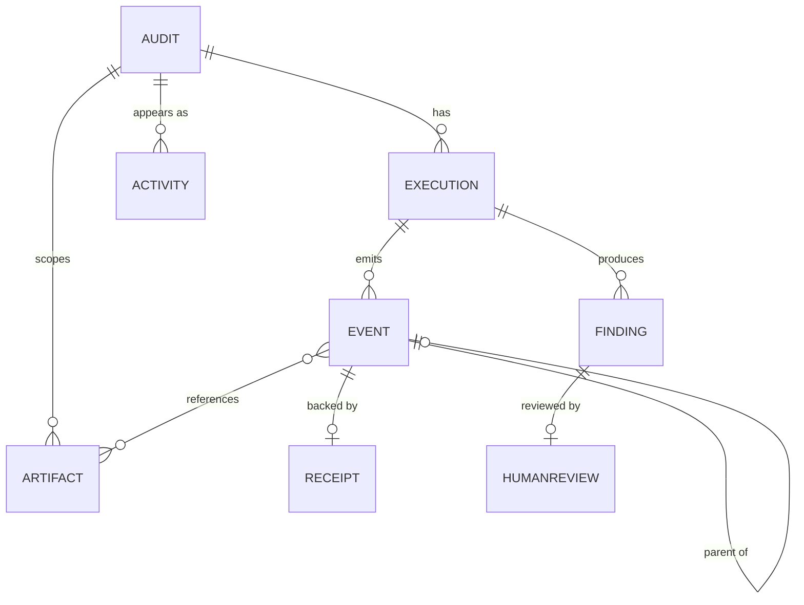

# Data Model

Minimum viable schema for the demo. Per guideline §7: keep it simple, no
enterprise database model in an 8-hour build.

There is **no database**. These are TypeScript types over data that is either
regenerated deterministically from a seed or held in session storage
(`ARCHITECTURE.md` §4).

---

## 1. Entities



| Entity | Synthetic? | References CooL? | Count in the demo |
|---|---|---|---|
| `Audit` | yes, seeded | no | 14 (1 hero + 13 simulated) |
| `Execution` | yes, seeded | indirectly, via events | ~18 |
| `Event` | yes, seeded | **yes**, `cool` reference | 30 for the hero; ~0 for simulated |
| `Artifact` | yes, authored | committed in payloads | 4 for the hero |
| `Finding` | yes, deterministic | via its `finding.created` event | 3 for the hero |
| `HumanReview` | yes, deterministic | via `human.review.completed` | 3 for the hero |
| `Receipt` | **no — real CooL output** | it *is* the CooL artifact | 9 for the hero |
| `Activity` | yes, seeded | no | 50+ history rows |

Only `Receipt` is genuinely produced by cryptography. Everything else is
synthetic scenario data, and the README and UI say so.

---

## 2. Definitions

### Audit

```ts
type Audit = {
  auditId: string;              // "AUD-FIN-2026-09"
  scenario: "financial" | "legal" | "cyber" | "procurement";
  title: string;                // "September Revenue Recognition Audit"
  period: string;               // "2026-Q3"
  openedAt: string;             // RFC 3339, logical
  closedAt: string | null;
  status: "completed" | "in_review" | "open";
  isHero: boolean;              // exactly one true
  executionIds: string[];
  artifactIds: string[];
  summary: {
    controlsTested: number;     // 12
    controlsPassed: number;     //  9
    exceptions: number;         //  3
    humanReviewCompleted: boolean;
  } | null;
  searchTags: string[];         // feeds the index — see SEARCH_SPEC.md
};
```

### Execution

```ts
type Execution = {
  executionId: string;          // "EXEC-FIN-2026-09-001" — the CooL executionId
  auditId: string;
  startedAt: string;
  completedAt: string | null;
  engine: { name: string; version: string };
  eventIds: string[];           // causal order
  rootEventId: string;
  coolBacked: boolean;          // true only for the hero in P0
  logHead: {                    // the STH captured when this execution was sealed
    logId: string;
    treeSize: number;
    rootHash: string;
  } | null;
};
```

`logHead` is what makes the append-only demo possible: months later we can prove
today's tree still contains the tree that existed when this execution was signed.
`CONFIRMED` working via `consistencyProof` / `verifyConsistency`.

### Event

Defined in full in `EVENT_MODEL.md` §2. Key fields: `eventId`, `auditId`,
`executionId`, `sequence`, `type`, `actor`, `occurredAt`, `parentEventId`,
`artifactRefs`, `title`, `summary`, `detail`, `inputPayload`, `outputPayload`,
`cool`.

### Artifact

```ts
type Artifact = {
  artifactId: string;           // "ART-FIN-001"
  auditId: string;
  kind: "revenue_ledger" | "contract" | "approval_log" | "policy" | "access_export" | "vendor_file";
  title: string;                // "Q3 Revenue Ledger Extract"
  mimeType: string;
  rows: number | null;
  content: string;              // the synthetic plaintext VeriAudit holds
  contentCommitment: string | null;  // mh:sha256:… once it has been committed
  ingestedAt: string;
  citedByEventIds: string[];
};
```

`content` is synthetic and stays in VeriAudit. What reaches CooL is a commitment,
so the evidence viewer can show the plaintext next to the commitment and let a
judge recompute it — `CONFIRMED` that `saltedCommit(salt, plaintext)` reproduces
the stored commitment and an altered plaintext does not.

### Finding

```ts
type Finding = {
  findingId: string;            // "F-FIN-001"
  auditId: string;
  executionId: string;
  eventId: string;              // the finding.created event
  controlId: string;            // "REV-REC-01"
  severity: "high" | "medium" | "low";
  title: string;                // "Revenue recognized before performance obligation satisfied"
  rationale: string;
  evidenceArtifactIds: string[];
  amountUsd: number | null;
  status: "open" | "accepted" | "modified" | "rejected";
  reviewId: string | null;
};
```

### HumanReview

```ts
type HumanReview = {
  reviewId: string;             // "REV-FIN-001"
  findingId: string;
  eventId: string;              // the human.review.completed event
  reviewer: { name: string; role: string };
  decision: "accepted" | "modified" | "rejected";
  note: string;
  reviewedAt: string;
  modifiedSeverity: Finding["severity"] | null;
};
```

### Receipt (the CooL artifact)

```ts
type StoredReceipt = {
  receiptRef: string;           // IndexedDB key = `${executionId}:${eventId}`
  eventId: string;
  evidence: unknown;            // the verbatim cool.receipt.v2 envelope, ~30 KB
  storedAt: string;
};
```

The envelope is stored **verbatim and never normalised**. `CONFIRMED`:
`JSON.parse(JSON.stringify(evidence))` still verifies, but any reformatting of
numbers or keys would break `binding_hash` — which is the tamper detection
working as designed.

The compact `CoolReference` that lives on the event is defined in
`COOL_INTEGRATION.md` §4.

### Activity (the history feed row)

```ts
type Activity = {
  activityId: string;           // "ACT-0042"
  occurredAt: string;           // RFC 3339, logical
  type: "audit" | "control_test" | "evidence_review" | "finding"
      | "follow_up" | "human_review" | "compliance_check"
      | "vendor_review" | "access_review";
  title: string;
  auditId: string | null;       // links back to an audit when there is one
  executionId: string | null;
  status: "completed" | "exception" | "in_review" | "scheduled";
  findingId: string | null;
  actor: "ai" | "human" | "system";
  searchTags: string[];
  coolBacked: boolean;          // true only for hero rows in P0
};
```

This is the entity the guideline §11 asks for: timestamp, title, type, audit
association, status, optional finding, optional execution id.

---

## 3. Identifiers and determinism

| Id | Format | Stable across regeneration? |
|---|---|---|
| `auditId` | `AUD-<SCN>-<YYYY>-<MM>` | **yes** — seeded |
| `executionId` | `EXEC-<SCN>-<YYYY>-<MM>-<NNN>` | **yes** |
| `eventId` | `EVT-<SCN>-<YYMM>-<NNN>` | **yes** |
| `artifactId` / `findingId` / `reviewId` / `activityId` | `ART-`/`F-`/`REV-`/`ACT-` + counter | **yes** |
| `cool.recordId` | ULID from the SDK | **no** |
| `cool.bindingHash` | `mh:sha256:…` | **no** — `CONFIRMED`, fresh salt per record |
| `cool.keyId` | `cool-enclave-<10 hex>` | **yes** — pure function of `(appName, COOL_IMAGE_DIGEST)` |

The rule this produces: **never join on a CooL identifier.** VeriAudit ids are
the primary keys; CooL ids are attributes of one sealing.

---

## 4. Indexes and search fields

No database, so "indexes" are in-memory structures built at load
(`SEARCH_SPEC.md`):

| Index | Over | Used for |
|---|---|---|
| inverted token index | `title`, `summary`, `searchTags` of `Audit`, `Activity`, `Finding`, `Event` | full-text search |
| `byAuditId` | `Execution`, `Event`, `Artifact`, `Finding`, `Activity` | opening an audit |
| `byExecutionId` | `Event` | building the trail |
| `byParentEventId` | `Event` | causal graph edges |
| `byDate` | `Activity`, sorted descending | the history feed and date filters |
| `byType` / `byStatus` | `Activity`, `Event` | facet filters |
| `byReceiptRef` | `StoredReceipt` (IndexedDB key) | loading a receipt on demand |

Guaranteed search targets for the hero audit: `revenue recognition`,
`revenue recognition exception`, `approval missing`, `September revenue audit`,
`REV-REC-01`, `F-FIN-001`. Asserted by a test.

---

## 5. Storage footprint

| What | Size | Where |
|---|---|---|
| Generated corpus (14 audits, ~18 executions, 50+ activities, 30 hero events) | ~150 KB in memory | regenerated |
| 9 hero receipts | ~270 KB | IndexedDB |
| `logState` | ~2.5 KB | IndexedDB |
| `CoolReference` per event | ~330 bytes each | with the event |

Comfortable. The number that constrains the design is 30 KB/receipt
(`COOL_SDK_AUDIT.md` §8), which is why receipts are fetched on demand and never
embedded in list responses.
