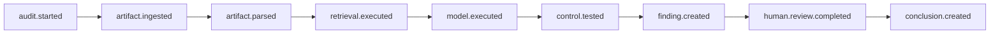

# Event Model

The event model is what makes VeriAudit more than a log viewer. Per guideline
Rule 7: events must carry relationships, not be isolated lines.

> **Milestone 5 note.** Reconstruction walks `parentEventId` via
> `whyConclusion()` and returns that path as `graph.spineEventIds`. Search
> indexes event titles/summaries at weight 0.8 so they do not outrank audits.
>
> **Milestone 4 note.** The shared event model is unchanged. The three-month
> simulation adds `Activity` rows that *reference* existing `auditId` /
> `executionId` / `eventId` values. It does not introduce a second event type
> and it does not seal simulated history.
>
> **Milestone 3 status.** The shared event model and the 30-event hero chain
> were built in Milestone 2 (`lib/audit/events.ts`). Milestone 3 adds the
> append-only trail (`lib/audit/trail.ts`), deterministic query
> (`lib/audit/query.ts`), and trail integrity (`lib/audit/integrity.ts`):
> rehydration of the RFC 6962 tree from public hashes, receipt-to-leaf
> binding, and historical tamper detection. `CONFIRMED` by 15 new tests.
> `human.review.requested` and `tool.executed` remain unused (`TODO`, P1).

---

## 1. Event types

VeriAudit's vocabulary, taken from the source of truth §6. The `type` string is
passed straight through to `cool.record({ type })`, so the same vocabulary
appears in the receipts.

| `event_type` | Actor | CooL-backed (P0) | Meaning |
|---|---|---|---|
| `audit.started` | system | yes | an audit engagement began |
| `artifact.ingested` | system | yes | a synthetic evidence artifact entered scope |
| `artifact.parsed` | ai | yes | an artifact was interpreted into structured figures |
| `retrieval.executed` | ai | yes | relevant evidence was selected for the model |
| `model.executed` | ai | yes | the reasoning step ran |
| `control.tested` | ai | yes | one control was evaluated to pass/exception |
| `finding.created` | ai | yes | an exception became a reportable finding |
| `human.review.requested` | system | P1 | the finding was routed for human verification |
| `human.review.completed` | human | yes | a reviewer accepted / modified / rejected it |
| `conclusion.created` | system | yes | the audit's final aggregate result |
| `tool.executed` | ai | P1 | an auxiliary tool call |

`CONFIRMED` — the nine P0 types are recorded and verified against the real SDK
as a **nine-event chain sharing one `executionId`**, every receipt `ok: true`
under the production trust policy. First proved with an 8-event harness in
discovery (`COOL_SDK_AUDIT.md` §4); confirmed end to end from the audit engine
in Milestone 2 (tests E1, E3, E5).

---

## 2. Event shape

```ts
type VeriAuditEvent = {
  // identity
  eventId: string;              // "EVT-FIN-2609-004" — deterministic, ours
  auditId: string;              // "AUD-FIN-2026-09"
  executionId: string;          // "EXEC-FIN-2026-09-001" — passed to CooL
  sequence: number;             // 0-based position within the execution

  // classification
  type: EventType;
  actor: "ai" | "human" | "system";
  occurredAt: string;           // RFC 3339, LOGICAL time from the simulated clock

  // software identity (mirrors CooL's `software` block)
  software: { name: string; version: string; digest: string | null };

  // causality
  parentEventId: string | null;
  // children are DERIVED — childrenOf(events, id) filters on parentEventId.
  // Storing both directions means two fields that can disagree.

  // references
  artifactRefs: string[];       // ARTIFACT ids this event consumed or produced
  findingRef: string | null;
  reviewRef: string | null;
  controlRef: string | null;    // added in M2: which control this event tested
  canonical: boolean;           // added in M2: is this one of the sealed nine

  // content
  title: string;                // human-readable, shown on the node
  summary: string;              // one or two sentences, shown on expand
  detail: Record<string, unknown>;  // type-specific structured fields

  // payload commitments (the plaintexts VeriAudit holds; CooL holds only hashes)
  inputPayload: string | undefined;
  outputPayload: string | undefined;

  // CooL
  cool: CoolReference | null;   // null = honestly "no cryptographic evidence"
  verification: VerificationState | null;  // last computed, never persisted as truth
};
```

### Field-by-field mapping to CooL

| VeriAudit field | Where it lands in the receipt |
|---|---|
| `type` | `record.event.type` — cleartext |
| `executionId` | `record.event.execution_id` — cleartext |
| `eventId`, `auditId`, `parentEventId`, `sequence`, `actor`, `occurredAt`, `summary`, `detail`, `artifactRefs` | inside `metadata`, committed as `record.event.metadata_hash` + `metadata_salt` — **not recoverable from the receipt** |
| `software` | `record.event.software` — cleartext by design |
| `inputPayload` | `record.event.commitments.input` + `input_salt` |
| `outputPayload` | `record.event.commitments.output` + `output_salt` |
| — | `record.record_id`, `record.time.issued_at`, `time.seq`, `runtime.*`, `signature`, `binding_hash`, `inclusion`, `sth`, `attestation`, `key_directory` are produced by the SDK |

`CONFIRMED` — the receipt leaks none of the metadata values. A search for
`"AUD-FIN-2026-09"`, `"REV-REC-01"`, `"C-1001"`, `"high"`, and the conclusion
text in the serialised receipt returned `false` for all five.

### Two clocks, deliberately

- `occurredAt` — VeriAudit's **logical** time. The hero audit is dated ~3 months
  before "today" so history can bury it. Committed inside `metadata`.
- `record.time.issued_at` — CooL's **sealing** time, set by the plane, always
  "now".

These differ, and the UI must not present the sealing time as when the audit
happened. What CooL attests is "this content was sealed at `issued_at` and has
not changed since" — not "this happened three months ago". Called out in
`SECURITY_AND_CLAIMS.md`.

---

## 3. Relationships

The canonical causal spine, one edge per `parentEventId`:



Matching the source of truth §7 exactly:

```text
Source Evidence → Retrieval → Model Execution → Control Test
              → Finding → Human Review → Final Conclusion
```

Rules:

1. Exactly one root per execution: `audit.started`, with `parentEventId: null`.
2. Every other event has exactly one parent — a tree, so reconstruction is
   unambiguous and no layout algorithm is needed.
3. `artifact.ingested` may fan out (one per artifact) and `control.tested` may
   fan out (one per control). The hero trail **collapses fan-out into one
   representative node per stage** with a count badge, so the graph stays the
   nine-node spine a judge can read in seconds.
4. `sequence` is monotonically increasing in causal order and equals the order in
   which events were recorded to CooL — so `sequence` and `inclusion.leaf_index`
   move together within an execution.
5. Events are append-only. A correction is a new event, never an edit. This is
   what makes the CooL receipts meaningful: a mutable event would have a
   receipt that no longer matches it.

### Full hero fan-out (what is generated vs. displayed)

```text
audit.started                                    1 event
└── artifact.ingested          × 4 artifacts     4 events   (1 node, "4 artifacts")
    └── artifact.parsed        × 4               4 events   (1 node)
        └── retrieval.executed × 1               1 event
            └── model.executed × 1               1 event
                └── control.tested × 12          12 events  (1 node, "12 controls / 3 exceptions")
                    └── finding.created × 3      3 events   (3 nodes — these matter individually)
                        └── human.review.completed × 3  3 events
                            └── conclusion.created × 1   1 event
                                                 = 30 events
```

**P0 decision:** generate all 30 as product events, but CooL-record the **nine
canonical representatives** (`COOL_INTEGRATION.md` §3) — 9 × 30 KB ≈ 270 KB and
~150 ms. `TODO` (P1): record all 30 if the Vercel timing test leaves room.

`CONFIRMED` in Milestone 2: exactly 30 events with exactly those counts
(test D1), 9 sealed, 21 carrying `cool: null` (test E2).

### Choosing the representatives — `CONFIRMED` as built

The canonical nine are not "the first event of each stage". They are chosen so
they form an **unbroken parent chain** from `audit.started` to
`conclusion.created`, which is what makes the reconstruction verifiable with no
unsealed gap in the middle. Three choices this forced, each a deliberate
deviation from "pick the first":

1. **`retrieval.executed`'s parent is the *primary* artifact's parse**, not an
   arbitrary one. The other three parses are siblings hanging off their own
   ingest events.
2. **The representative `control.tested` is the control behind the primary
   finding** (`REV-REC-01`), not the first control tested. The control that
   matters three months later is the one that caused the finding being
   challenged; `TXN-AUTH-01` passing is not what anybody disputes.
3. **`conclusion.created`'s parent is the review of the primary finding.**
   Causally the conclusion follows *all* three reviews, but the spine follows
   the one being reconstructed. Parenting it to the last review in sequence
   order would route the hero path through `F-FIN-003` — a severity
   downgrade — instead of the $1.42 M revenue finding.

All three `finding.created` events are individually canonical-eligible but only
the first is sealed in P0; each one's parent is its own `control.tested`, so
`Evidence → Control → Finding` holds for every finding whether sealed or not
(test D4).

Asserted for **all four scenarios**, not just the hero: test D5 checks the nine
are present, in the documented type order, and that each one's parent is the
previous one.

### Reconstruction, as implemented

```ts
ancestorsOf(events, conclusionEventId)  // → root-first path
childrenOf(events, eventId)             // → forward edges, sequence-ordered
```

`ancestorsOf` walks `parentEventId` to the root and throws on a cycle rather
than looping. For the hero execution it returns exactly the canonical nine, in
the documented order, every one of them CooL-backed (tests D6, F1). That
equality is the whole claim: *the answer to "why did this conclusion happen?" is
the set of events that are cryptographically sealed.*

---

## 4. Event identifiers

Deterministic and human-legible, so search and demo scripts can reference them:

```text
AUD-FIN-2026-09            audit
EXEC-FIN-2026-09-001       execution
EVT-FIN-2609-004           event      (audit short code + zero-padded sequence)
ART-FIN-001                artifact
F-FIN-001                  finding
REV-FIN-001                human review
```

`CONFIRMED` — these are VeriAudit's ids and are stable across regenerations
because the engine is pure, not merely seeded: `EVT-FIN-2609-001` through
`EVT-FIN-2609-030` every run, on every instance (test D8). CooL's `record_id`
(a ULID) and `binding_hash` are **not** stable — `COOL_SDK_AUDIT.md` §7.2, since
`randomSalt()` draws fresh bytes per record. So a `binding_hash` must never be
used as a logical event identifier; it identifies one sealing of that event.

Live review events continue the same sequence (`EVT-FIN-2609-031`, …). The
**caller** supplies the sequence, exactly as it supplies `logState`: the server
is stateless and cannot know how many events a session already holds.

---

## 5. Verification state

Computed, never persisted as truth — recomputed from the receipt whenever shown:

```ts
type VerificationState = {
  status: "verified" | "failed" | "unavailable" | "not-recorded";
  verdictOk: boolean;          // verifyEvidence().ok
  signerTrusted: boolean;      // key_id in the published allow-list
  logged: boolean;             // inclusion.status === "pass"
  domains: Record<Domain, { status: DomainStatus; detail: string }>;
  reasons: string[];           // the SDK's own strings, shown verbatim on failure
  checkedAt: string;
};
```

Four distinct states, because collapsing them would be dishonest:

- `verified` — verdict `ok`, signer trusted, and inclusion passed.
- `failed` — a domain failed. Show the failing domains and the SDK's `reasons`.
- `unavailable` — the receipt is not in this session's store. **Not** a failure.
- `not-recorded` — no CooL receipt was ever created (all simulated history).

---

## 6. Persistence

| Data | Where | Why |
|---|---|---|
| Events, audits, artifacts, findings, reviews | regenerated from the seed | deterministic, identical on every instance and cold start |
| `CoolReference` per event | with the event, in session state | ~330 bytes |
| Full receipts (~30 KB) | IndexedDB, keyed by `receiptRef` | too large for `localStorage` |
| `logState` (ordered `binding_hash[]`) | IndexedDB + sent with each record call | rehydrates the RFC 6962 tree; ~80 bytes/event, no secrets |
| Hero execution's STH | IndexedDB | the "three months ago" tree head for the append-only proof |

See `DATA_MODEL.md` for entity detail and `ARCHITECTURE.md` §4 for why there is
no database.

---

## 7. Append-only trail — `CONFIRMED` as of Milestone 3

The events exist after Milestone 2. Milestone 3 is the rule they live under.

### Application invariant (`lib/audit/trail.ts`)

`ExecutionTrail.replace`, `.remove`, and `.reorder` throw `AppendOnlyError`.
The only legal write is `.append`, which returns a **new** trail. The original
event ids still resolve after a correction. Test I1 / I2.

This is not storage theatre. A CooL receipt that still verifies after the
application silently rewrote the event it describes is a receipt of nothing.

### Query (`lib/audit/query.ts`)

| Access | Function | Order |
|---|---|---|
| by event id | `eventById` | — |
| by type | `eventsByType` / `?type=` | sequence |
| chronological | `queryEvents({ order: "occurredAt" })` | logical clock, then sequence |
| sequence | default | sealed order = leaf order |

This is not search. No ranking, no natural language (`TODO`, Milestone 5).

### Reconstruction

`ExecutionTrail.whyConclusion()` walks `parentEventId` from `conclusion.created`
to the root. For every scenario it returns the nine sealed types in the
documented order, every step `sealed: true` (test H1, J1). Array order is not
consulted.

### Rehydration (`lib/audit/integrity.ts`)

```text
fingerprintLogState(logState)     → { logId, treeSize, rootHash }
proveTrailContinues(head, later)  → RFC 6962 consistency, not an application flag
```

`CONFIRMED` (test K1): capture the hero tree head → discard the live
`MemoryLog` → rebuild from the public hashes alone → root matches → append one
more sealed event → consistency proof holds → new root differs.

The tree head itself is **not** stable across regenerations. A fresh
`runAndSeal` draws new salts, so a later run produces a different root. What
rehydrates is one sealing's `logState`, held by the session that ran it.

### Historical tamper (`CONFIRMED`, tests L1–L5)

| Attack | What fails | Mechanism |
|---|---|---|
| Rewrite a sealed event's title | `bindReceipt.bound === false` | `contentDigest` no longer matches the digest stored on the `CoolReference` |
| Delete a historical leaf | `proveTrailContinues.ok === false` | RFC 6962 consistency; also the shrink short-circuit |
| Reorder two leaves | `proveTrailContinues.ok === false` | rebuilt root ≠ captured head |
| Swap two genuine receipts | `bindReceipt.bound === false` | type / binding_hash / leafIndex disagree; each receipt still `verifyReceipt.ok` |
| Flip the conclusion's output commitment | `verifyReceipt.ok === false` | SDK binding + signature domains |

No failure is invented in application code. The first and fourth cases combine
a genuine CooL receipt with an application binding check — CooL attests
authenticity, the tree attests position, and both are required.
